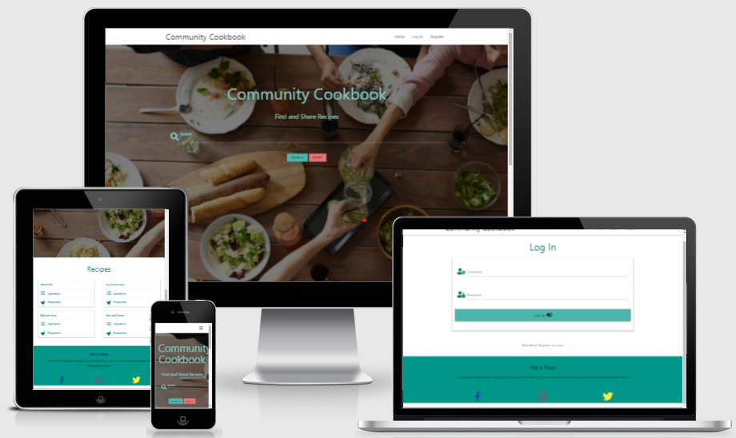

# Community Cookbook

Site for finding new recipes and sharing your own recipes. The main goal of the site is for a cookware company, "Pots n Pans", to aquire customers by getting the brand name out to food lovers and potential costumers, and directing them to social media to purchase the best cookware the world has ever known.

[Live site through Heroku](https://milestone-cookbook.herokuapp.com/)

## UI/UX

#### As a site user I would like to:

* Search for new recipes
* Share my Own recipes
* Edit/delete my uploaded recipes
* Be able to register/log in

#### As the site owner I would like to:

* Access, edit and delete all information on site

## Structure

* Quick access community uploaded meals
* Easily search for meals by ingredients or meal type

    [Recipes](images/home.png)

    [Add Recipe](images/add_recipe.png)

    [Log In](images/log_in.png)

    [Profile](images/profile.png)

    [Register](images/register.png)

## Features

* Instantantly search for whatever food you crave
* Simple accordion drop downs to any meal that looks interesting
* No life stories or longwinded tales, just ingredients required and the steps to prepare
* Simply register/log in to share recipes of your own
* Navbar will prompt to register or if logged in will allow users to contribute their own recipes
* Once registered/logged in, users have the ability to add, edit and delete their own reciepe uploads 
* all recipes can be viewed but not edited when unregistered/not logged in
* Once logged in, users can view all reciepes but only add, edit and delete their own uploads
* search scans through recipe name, category, description and ingredients
* Once successfully logged in/ registered users are welcomed to their profile page
* Adding a new recipe requires all fields filled
* Delete a recipe requires a confirmation
* Editing a recipe has fields pre-filled for convienience  
* Cannot register an existing username

### Features left to implement

* Images of uploaded meals
* Comments & possibly ratings of recipes by community members

## Technologies used

* HTML5
* CSS3
* Javascript
* Flask
* Jquery
* MongoDB
* Materialize
* Github
* Gitpod
* Heroku
* Fontawesome
* Balsamiq

## Testing
#### Automated
* Jigsaw only shows 1 error in materialize file
* No errors in w3 html validator
* No error in JSHint
* PEP8 threw 2 indentation errors, now fixed

#### User Story Testing
##### Search for new recipes:
* Search function works great, returns a match if keyword is found in any part of recipe, no results found if not
##### Share my Own recipes:
* Add recipe form sends to MongoDB as desired, data all showing up in database and retrievable
##### Edit/delete my uploaded recipes:
* Buttons work as desired, edit page successfully retrieves information and saves or deletes changes
##### Be able to register/log in:
* All login passwords stored in encrypted keys, pages show errors when input criteria not met
##### Access, edit and delete all information on site:
* Administrative functions in place have power to edit/remove desired recipe

#### Bugs
* I strugled with the parallax image(background image on recipes page) for more time than I'd like to admit, the error turned out to be a Jinja v Materialize conflict, lack of {{ url_for }} syntax 
* Had contrast issues caused by materialize so had to override, found solution to similar problem at https://stackoverflow.com/questions/38996019/how-to-change-the-text-color-in-a-materializecss-select-dropdown

## Deployment
* This project was made using Gitpod

#### MongoDB

* Log in to Mongo MongoDB
* Click on the Cluster's link under "Data Storage"
* Select "connect your application"
* Select the version of python you are using and copy link provided
* In cluster overview, click connect
* Install PyMongo with "pip3 install pymongo"

#### Heroku

* In Gitpod, create requirements.txt using "pip3 freeze --local > requirements.txt"
* Create Procfile using "echo web: python app.py > Procfile"
* Log into Heroku, click new app
* Navigate to deployment page, click the Github logo and connect desired repository
* Navigate to settings, select reveal config vars and set variables
* Return to deploy page and enable automatic deploys

## Credits

* code for the validate input line under meal type in tha add recipe form was used from jquery from the Materialize Form Validation video from the mini project (https://courses.codeinstitute.net/courses/course-v1:CodeInstitute+DCP101+2017_T3/courseware/196c000dd670458cafc7b2dc9d4a8245/f2ad3c6775ce4890a53e62de35245c0a/?activate_block_id=block-v1%3ACodeInstitute%2BDCP101%2B2017_T3%2Btype%40sequential%2Bblock%40f2ad3c6775ce4890a53e62de35245c0a)

### Images

* Photo by fauxels from Pexels - https://www.pexels.com/photo/woman-pouring-juice-on-glass-3184192/