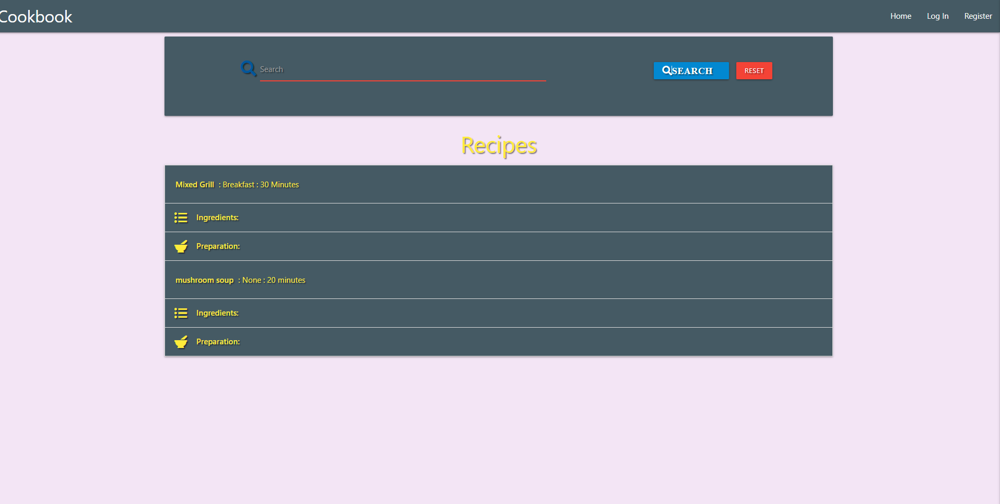
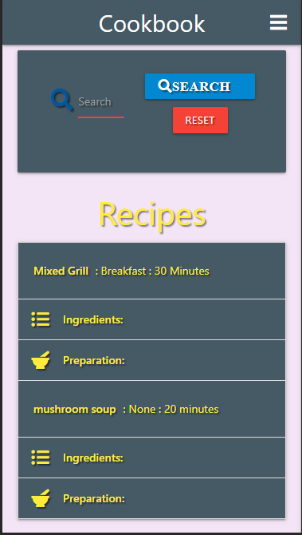

# Online Cookbook

Site for finding new recipes and sharing your own recipes.

[Live site through Heroku](https://milestone-cookbook.herokuapp.com/)

## UI/UX

#### As a site user I would like to:

* Search for new recipes
* Share my Own recipes
* Edit/delete my uploaded recipes
* Be able to register/log in

#### As the site owner I would like to:

* Access, edit and delete all information on site

## Structure

* Instant access community uploaded meals
* Easily search for meals by ingredients or meal type

[wireframes](/workspace/milestone-3-cookbook/images/milestone-3-cookbook.pdf)

## Features

* Instantantly search for whatever food you crave
* Simple accordion drop downs to any meal that looks interesting
* Kept to the essentials, no life stories or longwinded tales, just ingredients required and steps to prepare
* Simply register/log in to share recipes of your own
* Navbar will prompt to register or if logged in will allow users to contribute their own recipes
* Once registered/ logged in, users have the ability to add, edit and delete their own reciepe uploads 

### Features left to implement

* Images of uploaded meals
* Comments & ratings of recipes by community members

## Technologies used

* HTML5
* CSS3
* Javascript
* Flask
* Jquery
* MongoDB
* Materialize
* Github
* Gitpod
* Heroku
* Fontawesome
* Balsamiq

## Testing

* all reciepes can be viewed but not edited when unregistered/ not logged in
* Once logged in users can view all reciepes but only add, edit and delete their own uploads
* search scans through recipe name, category, description and ingredients
* Once successfully logged in/ registered users are welcomed to their profile page
* Adding a new recipe requires all fields filled
* Delete a recipe requires a confirmation
* Editing a recipe has fields pre-filled for convienience  
* Cannot register an existing username
* Would like to implement more back end security features down the line 

* ran code through W3C, Jigsaw, JS Hint and PEP8 validators

## Deployment

* Initial push to Github which was set to automatically deploy to Heroku
* Pushed no sensitive keys or code through git, set config vars on heroku to interperet files

## Credits

* code for the validate input line under meal type in tha add recipe form was used from jquery from the Materialize Form Validation video from the mini project (https://courses.codeinstitute.net/courses/course-v1:CodeInstitute+DCP101+2017_T3/courseware/196c000dd670458cafc7b2dc9d4a8245/f2ad3c6775ce4890a53e62de35245c0a/?activate_block_id=block-v1%3ACodeInstitute%2BDCP101%2B2017_T3%2Btype%40sequential%2Bblock%40f2ad3c6775ce4890a53e62de35245c0a)

### Images

* Photo by fauxels from Pexels - https://www.pexels.com/photo/woman-pouring-juice-on-glass-3184192/